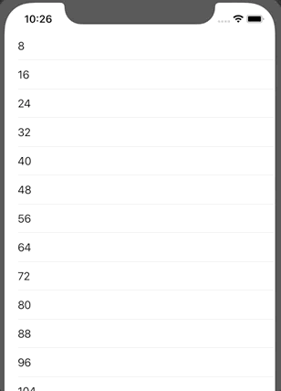

# refresher
Project to play around with using a custom spinner for a UIRefreshControl.



## Requirements
* Cocoapods
* Xcode 11 or higher

To run, please execute:
```pod install```

Then build in Xcode

## Outcomes/learnings
* I initially used a subview to make a custom spinner for UIRefreshControl. I used a two step animation to spin the image 180 degrees, then another 180 degrees. Only after a full rotation, do we check for an exit condition. This gives the animation an odd, jerky kind of motion. Like it always snaps into a stationary position before sliding off the screen.
* To correct this, I rewrote the class to use layers instead of views. ```CAKeyframeAnimation(keyPath: "transform.rotation")``` with a ```repeatCount``` of infinity gives a nice smooth animation, as shown in the demo GIF above.
* But here I ran into the limitations of subclassing UIRefreshControl. Basically, ```endRefreshing()``` is not a good place to do the end-of-lifecycle events I wanted because it actually gets triggered while the refresh control is still on the screen. If I want to remove the layer and it's animation, I ideally need a method that happens after the control has left the screen. But UIRefreshControl has no override point for this.
* Since I had no good place to remove the layer, I had to make sure it only got added to the view once, even if the user pulls to refresh multiple times to avoid a leak.
* I also found I had to call ```beginRefreshing()``` explicitly once I overrode it, or it wouldn't get triggered. Still not sure why that is.
* Given these limitations, it might be worthwhile subclassing UIControl instead of UIRefreshControl to get more explicit control over the lifecycle.
